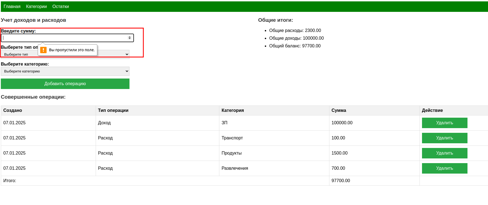
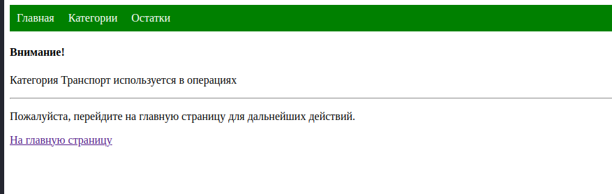
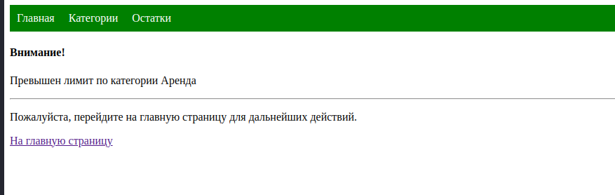
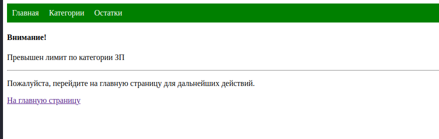

*Все поля обязательные на форме. В случае если их не ввести, то будет получено сообщение типа* 

*Также предусмотрена валидация при удалении категорий. В случае, если категория используется, тогда будет получено сообщение типа:*

8. Оповещения:
 - Оповещать пользователя, если превышен лимит бюджета по категории или расходы превысили доходы.

*Если расходы превысили доходы, тогда будет получено сообщение* 

*Если лимит по категории превышен, тогда будет получено сообщение*

9. Сохранение данных:
 - При выходе из приложения сохранять данные кошелька пользователя в файл.
 - При авторизации загружать данные кошелька из файла.

*Для реализации данного требования выполнено сохранение данных в файле БД(H2).*

10. Чтение команд пользователя в цикле:
 - Реализовать цикл для постоянного чтения команд пользователя. Поддержать возможность выхода из приложения.

*Чтение из цикла не требуется т.к взаимодействию с приложением реализовано через веб форму.*

## Описание запуска
Для локального запуска приложения необходимо:
1. С клонировать репозиторий
2. Сформировать конфигурацию запуска и запустить и с помощью встроенных средств используемой вами IDE

Также можно собрать .jar файл приложения с помощью gradle и запустить из консоли. Запуск с помощью докер не предусмотрен. Запуск приложений с помощью систем контейнеризации был рассмотрен в других модулях программы.