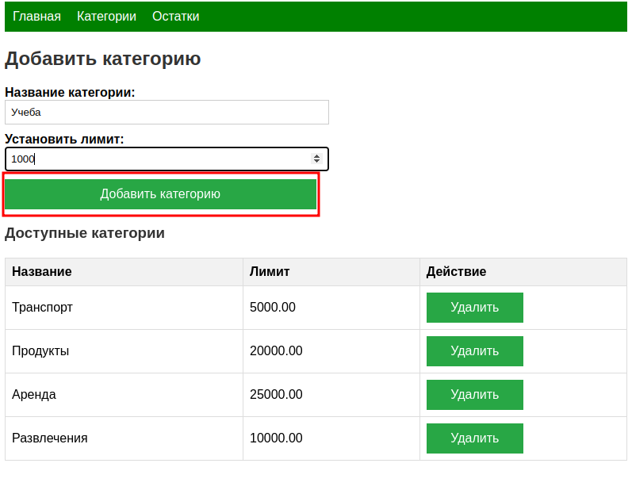
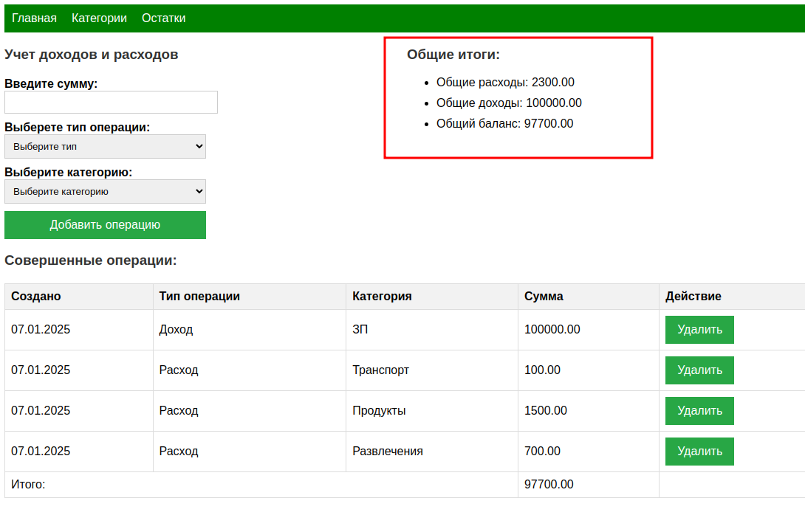

# Итоговый проект «Система управления личными финансами»

## Технические требования и описание реализации
Для успешного выполнения проекта ваше backend-приложение для управления личными финансами должно соответствовать следующим требованиям:

1. Хранение данных
 - Все данные должны храниться в памяти приложения.
    
*Хранение данных реализовано в in-memory БД H2.  Что соответствует требованию хранить в памяти приложения.* На данный момент включено хранение данный в файле, что соответствует требованиям п.9

2. Авторизация пользователей
 - Реализовать функциональность для авторизации пользователей по логину и паролю. Приложение должно поддерживать несколько пользователей.

*Для авторизации используется фреймворк Spring Security. Для начала работы с системой необходимо зарегистрировать пользователя. Для этого необходимо открыть приложение доступное по адресу http://localhost:8080/. После чего будет открыта форма авторизации. Далее нужно будет перейти по ссылке отмеченной ниже*

*После перехода на страницу регистрации нужно ввести имя пользователя и пароль, далее необходимо нажать кнопку зарегистрировать. После успешной регистрации вы будете автоматически перенаправлены на страницу входа, либо можно использовать ссылку указанную ниже. Далее вводим данные указанные на странице регистрации* 

3. Функционал управления финансами
 - Разработать логику для добавления доходов и расходов. Пользователь должен иметь возможность создавать категории для планирования бюджета.
 - Предусмотреть функциональность для установления бюджета на каждую категорию расходов.
*После перехода на страницу приложения вы сможете перейти на форму создания категорий указанную ниже*

*По умолчанию категорий нет, поэтому вам надо будет создать их вводя данные на представленной форме*

4. Работа с кошельком пользователя:
 - Привязать кошелёк к авторизованному пользователю. Кошелёк должен хранить информацию о текущих финансах и всех операциях (доходах и расходах).
 - Сохранять установленный бюджет по категориям.

*Кошелек привязан к пользователю на уровне иерархии классов. Также все операции и категории привязаны к одному кошельку, что удобно позволяет работать с ними на уровне кода и позволит в будущем удобно дорабатывать, например добавить возможность иметь несколько кошельков для одного пользователя*

5. Вывод информации:
 - Реализовать возможность отображения общей суммы доходов и расходов, а также данных по каждой категории.
 - Выводить информацию о текущем состоянии бюджета для каждой категории, а также оставшийся лимит.
 - Поддерживать вывод информации в терминал или в файл.

*Для отражения расходов введем несколько для примера. Для этого перейдем на страницу "главное"*

*И использую форму ниже введем некоторые расходы:*

*Далее мы можем перейти во вкладку "Остатки" и увидим текущее состояние остатков по категориям. Предполагается, что данный функционал призван контролировать именно расходы, без учета доходов по категориям. Т.е на текущий момент предполагается работа с двумя видами категорий: доходными и расходными. Например, мы можем создать доходную категорию с лимитом 0, тем самым не разрешив по ней тратить. Хороший пример ЗП, по которой нельзя уйти в минус. А вот по категориям расходов добавлять траты можно, но как можно заработать на тратах по продуктам - не понятно. Даже если был возврат, то запись можно удалить, тем самым скорректировав расчеты.*

6. Подсчет расходов и доходов:
 - Разработать методы, подсчитывающие общие расходы и доходы, а также по категориям.
 - Поддержать возможность подсчета по нескольким выбранным категориям. Если категория не найдена, уведомлять пользователя.

*По категориям подсчеты были описаны в пункте выше. Для общего учета предусмотрены поля на странице "главная"* 

7. Проверка вводимых данных:
 - Валидация пользовательского ввода и уведомление о некорректных данных.

*Все поля обязательные на форме. В случае если их не ввести, то будет получено сообщение типа* 

*Также предусмотрена валидация при удалении категорий. В случае, если категория используется, тогда будет получено сообщение типа:*

8. Оповещения:
 - Оповещать пользователя, если превышен лимит бюджета по категории или расходы превысили доходы.

*Если расходы превысили доходы, тогда будет получено сообщение* 

*Если лимит по категории превышен, тогда будет получено сообщение*

9. Сохранение данных:
 - При выходе из приложения сохранять данные кошелька пользователя в файл.
 - При авторизации загружать данные кошелька из файла.

*Для реализации данного требования выполнено сохранение данных в файле БД(H2).*

10. Чтение команд пользователя в цикле:
 - Реализовать цикл для постоянного чтения команд пользователя. Поддержать возможность выхода из приложения.

*Чтение из цикла не требуется т.к взаимодействию с приложением реализовано через веб форму.*

## Описание запуска
Для локального запуска приложения необходимо:
1. С клонировать репозиторий
2. Сформировать конфигурацию запуска и запустить и с помощью встроенных средств используемой вами IDE

Также можно собрать .jar файл приложения с помощью gradle и запустить из консоли. Запуск с помощью докер не предусмотрен. Запуск приложений с помощью систем контейнеризации был рассмотрен в других модулях программы.